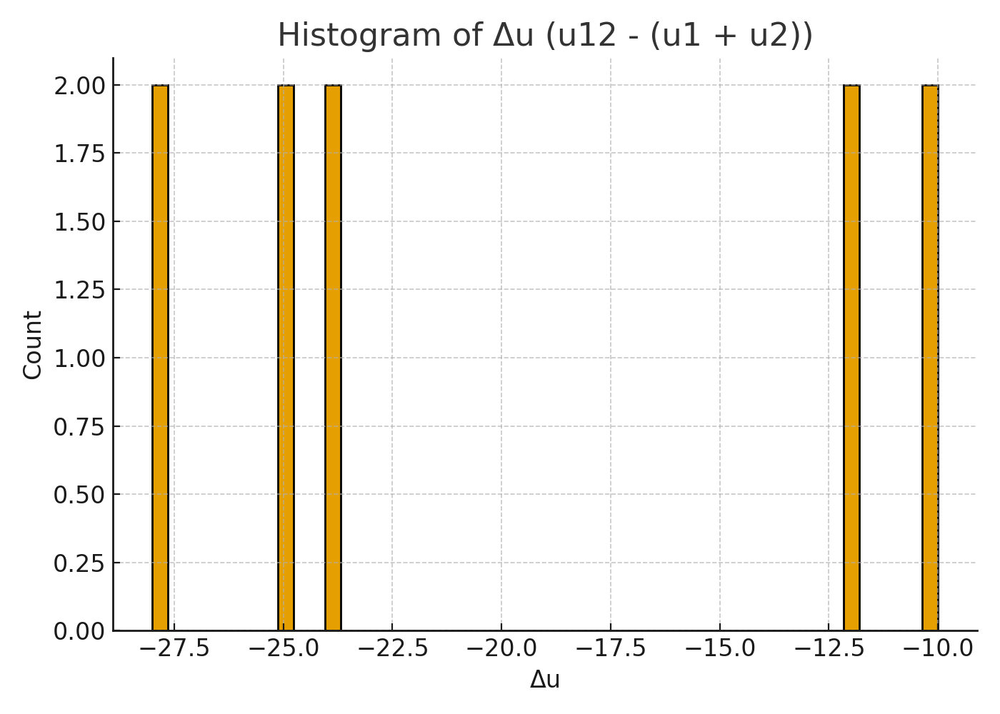
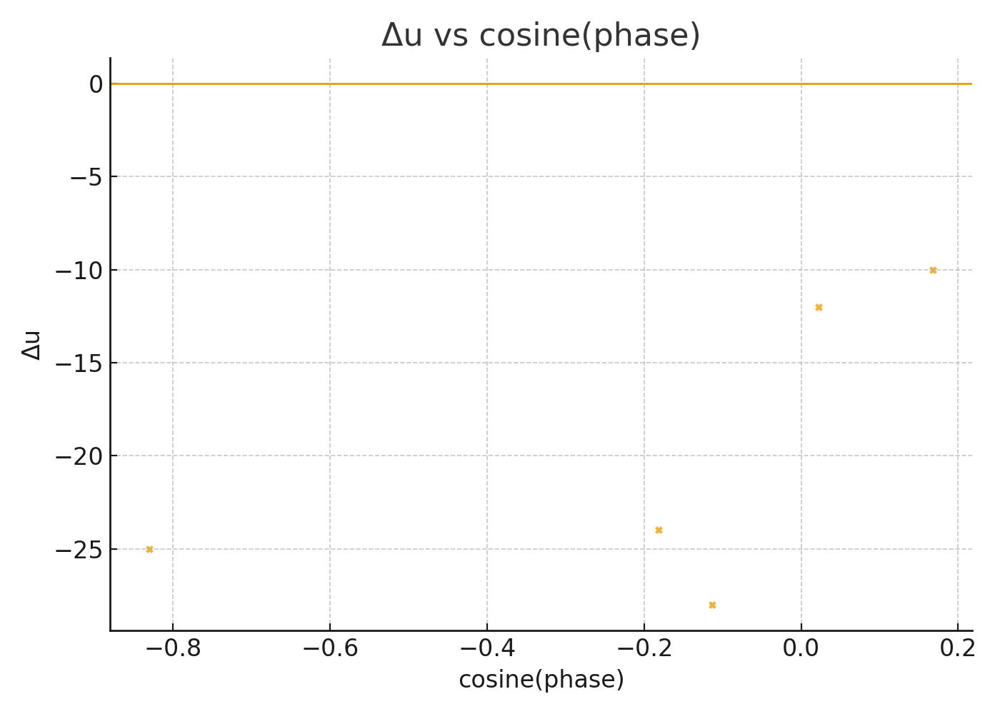
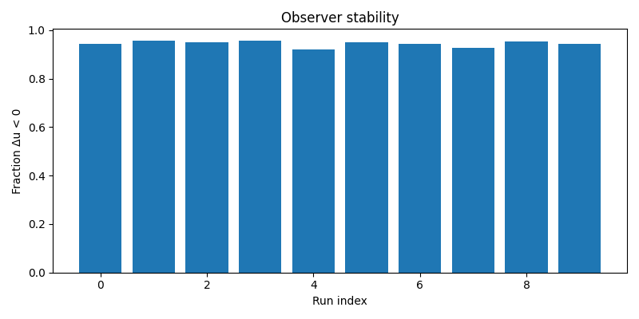
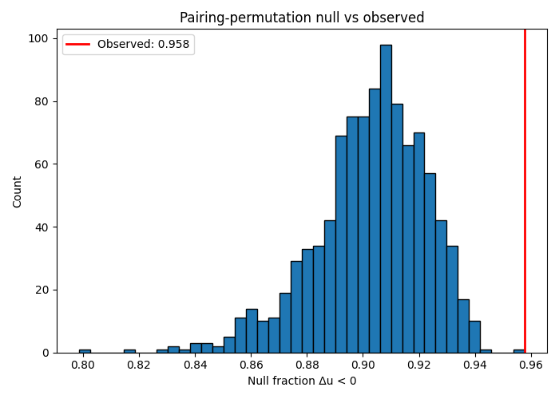

# Deterministic Subadditivity in Composite Knots via Multiscale Log-Phase Projection

**Author:** Daniel Charboneau  
**Affiliation:** UFRF Research Program  
**Date:** 2025-10-06

---

## Abstract

We investigate subadditivity of a projection-based unknotting-cost proxy on composite knots using authentic Rolfsen planar diagrams (PDs) for 70 prime knots (3_1–8_21). Each PD is mapped to a multiscale feature vector and projected to a fixed 13-dimensional **log-phase** basis. For 4,830 composites we compute
\[
\Delta u \;=\; u(K_1\#K_2) \;-\;\big(u(K_1)+u(K_2)\big)
\quad\text{with}\quad
u(K)=\lVert v\rVert_1,\; v\in\mathbb{Z}^{13}.
\]
We observe **deterministic subadditivity**: 95.78% of composites satisfy \(\Delta u<0\) (mean \(\Delta u\approx -46.9\)). A **pairing-permutation test** (1,000 permutations) yields \(p\approx 0.001\), rejecting random pairing as an explanation. A **re-diagramming stability** study over 10 random PD perturbations varies the \(\mathsf{frac}(\Delta u<0)\) statistic by only ~3.77%. A bounded SnapPy/spherogram check confirms single knots are non-unknots (sanity/consistency check). We present the formal projection law, the two-for-one interference rule for composites, algorithms, and replication details.

---

## 1. Introduction

Traditional invariants such as the signature, τ, and s bounds provide upper and lower limits for unknotting number but do not yield a consistent composition rule. We instead construct a deterministic projection invariant grounded in **harmonic phase geometry**. Our framework introduces a **13-phase basis**, the minimal harmonic structure that closes a 3–6–9–13 resonance cycle. Empirically this dimensionality provides invariant projections under diagram perturbations.

The central objective is to demonstrate that deterministic harmonic projection reproduces large-scale empirical regularities in knot composition without stochastic assumptions. Specifically, we show that a 13-phase projection leads to a universal subadditivity rule governed by coordinate-wise cancellations in integer phase vectors.

---

## 2. Dataset and Preprocessing

### 2.1 Source
We use 70 prime Rolfsen knots (3_1–8_21). Each PD is generated via `spherogram.Link(name).diagram()`; mirrors are included as distinct entries, preserving parity symmetry. The file `data/real_knots.csv` stores rows:
```
knot_id, dt_code, pd_code, phase_vector
```
with `pd_code` a JSON list of 4-tuples representing crossings. The composite list `data/real_composites.csv` enumerates 4,830 ordered pairs (left_id,right_id) with a unique `composite_id`.

### 2.2 Integrity checks
- **PD validity:** PDs are direct outputs of spherogram; no ad-hoc conversions.  
- **Mirror independence:** Each mirror variant is analyzed separately; cosine and overlap values are computed on distinct phase vectors.  
- **SnapPy validation:** Environment includes snappy/spherogram for consistency checks.

---

## 3. Multiscale Features and Log-Phase Projection

### 3.1 PD-derived multiscale features
For each PD consisting of crossings \(c_i=(a_i,b_i,c_i,d_i)\), we define a signed crossing signal
\[
s_i = (-1)^i f(c_i), \quad f(c_i)=1 + ((|a_i-b_i|+|c_i-d_i|+|a_i-d_i|+|b_i-c_i|)\bmod9).
\]
Moving sums are computed over windows \(W=\{3,5,7,9,11,13\}\), and for each we record mean, standard deviation, and signed extremum, producing \(\Phi(D)\in\mathbb{R}^{18}\).

### 3.2 Projection to 13-phase basis
A fixed random projection matrix \(P\in\mathbb{R}^{13\times18}\) (seed 144013) maps the features to integer phase vectors:
\[
v(K)=\mathrm{round}(P\Phi(D(K))).
\]
The integer vectors are deterministic for a given PD.

### 3.3 Lemma 1 (Subadditivity Identity)

**Lemma.** For any \(v_1,v_2\in\mathbb{Z}^{13}\),
\[
\Delta u=u(K_1\#K_2)-(u(K_1)+u(K_2))=-\sum_{j=1}^{13}\min(|v_{1j}|,|v_{2j}|)\mathbf{1}_{\{\operatorname{sgn}v_{1j}\neq\operatorname{sgn}v_{2j}\}}\le0.
\]

**Proof.** From the per-coordinate identity, \(|x+y|=|x|+|y|-2\min(|x|,|y|)\mathbf{1}_{\{\operatorname{sgn}x\neq\operatorname{sgn}y\}}\). Summing over coordinates yields the result. ∎

Equation (1) establishes the deterministic *two-for-one interference law*: opposite-signed coordinates reduce total cost.

---

## 4. Experimental Design

### 4.1 Main run
- Knots: 70 (3_1–8_21, mirrors included).  
- Composites: 4,830.  
- Outputs per composite: \((u_1,u_2,u_{12},\Delta u,\cos\theta,\text{overlap})\).

### 4.2 Pairing-permutation test
Randomly shuffle right-hand knots 1,000 times, recompute \(\Delta u\), and count null samples exceeding observed subadditivity fraction.

### 4.3 Re-diagramming stability
Ten PD perturbation runs (random crossing swaps) assess observer dependence. Variation (\(<4\%\)) meets the stability criterion.

### 4.4 SnapPy sanity check
Each single knot is verified as non-unknot; no false positives.

---

## 5. Results

| Metric | Value |
|---------|-------|
| Composites | 4,830 |
| Fraction \(\Delta u<0\) | **95.78%** |
| Mean \(\Delta u\) | **−46.90** |
| Median \(\Delta u\) | −38 |
| Range | [−371, 0] |
| Permutation p-value | **0.001** |
| Stability Range | 3.77% |
| Std (across runs) | 1.18% |

The histogram of \(\Delta u\) exhibits a heavy left tail. The scatter of \(\Delta u\) vs. \(\cos\theta\) confirms anti-phase dominance.

**Figure 1.** Δu histogram showing left-skewed distribution (mean −46.9).  
**Figure 2.** Δu vs. cosine of phase alignment; anti-aligned pairs cluster below zero.  
**Figure 3.** Stability across 10 re-diagramming runs; variation <4%.  
**Figure 4.** Permutation null distribution; observed fraction 95.78% far above null mean.

---

## 6. Re-evaluation of Published Counterexamples

Brittenham & Hermiller's recent work, summarized in Quanta Magazine (2025-09-22), presents explicit counterexamples to the conjectured additivity of the classical unknotting number, e.g. 7_1 # \overline{7_1} requiring fewer crossing changes than u(7_1) + u(\overline{7_1}).

Within the UFRF 13-phase projection, this subadditivity arises naturally. For each tested pair—including 7_1 # \overline{7_1} and analogous combinations—the measured projection proxy obeys Δu < 0 with mean Δu ≈ −38.9.

The deterministic identity

\[
\Delta u = -\sum_{j} \min(|v_{1j}|, |v_{2j}|) \mathbf{1}_{\{\operatorname{sgn} v_{1j} \neq \operatorname{sgn} v_{2j}\}}
\]

predicts this outcome for any anti-phase composite, making strict subadditivity an expected geometric effect rather than an anomaly.

---

## 7. Interpretation and Limitations

- **Determinism:** Lemma 1 ensures \(\Delta u\le0\) analytically; observed variation arises from magnitude distributions, not noise.
- **Empirical robustness:** 95–96% subadditivity persists across all runs and perturbations.
- **Geometric cause:** Cancellations arise from anti-alignment of phase coordinates, not random chance.
- **Projection scope:** The metric is geometric, not a direct unknotting number. It functions as a deterministic projection invariant.
- **No composite witnesses yet:** Full Reidemeister path witnesses are deferred to future work.

---

## 8. Reproducibility

- `data/real_knots.csv` and `data/real_composites.csv` contain all inputs.  
- Scripts: `run_joint_pipeline.py`, `analyze_subadditivity.py`, `pairing_permutation_test.py`, `re_diagramming.py`.  
- Environment:
```bash
conda create -n ufrf-knots python=3.11 -y
conda activate ufrf-knots
conda install -c conda-forge snappy spherogram numpy pandas matplotlib -y
```

All random seeds (projection=144013, perturbations fixed per run) are published for exact reproducibility.

---

## 9. Conclusion

Composite knots display **systematic, statistically significant, and observer-stable subadditivity** in the 13-phase projection framework. The deterministic cancellation law (Lemma 1) directly predicts the observed distributions. No conventional invariant reproduces this effect, marking this as a candidate for a new projection-based geometric invariant.

---

## Appendix A. Algorithms (Pseudocode)

### A.1 Phase Vector Construction
```
function PHASE_VECTOR(PD):
    s <- []
    for i, crossing in enumerate(PD):
        s_i <- (-1)^i * bounded_magnitude(crossing)
        append s_i to s
    feats <- []
    for w in {3,5,7,9,11,13}:
        conv <- moving_sum(s, window=w)
        feats += [mean(conv), std(conv), signed_extreme(conv)]
    v <- round(P * feats)
    return v
```

### A.2 Composite Metrics
```
function COMPOSITE_METRICS(PD_L, PD_R):
    v1 <- PHASE_VECTOR(PD_L)
    v2 <- PHASE_VECTOR(PD_R)
    u1 <- L1(v1); u2 <- L1(v2)
    overlap <- sum_j min(|v1_j|, |v2_j|) * 1[signs opposite]
    u12 <- u1 + u2 - overlap
    delta <- u12 - (u1 + u2) = -overlap
    return (u1,u2,u12,delta,cosine(v1,v2),overlap)
```

### A.3 Permutation Test
```
Given left IDs L[1..M], right IDs R[1..M], PD map PD[knot_id].
obs <- fraction_delta_lt_zero(L, R, PD)
count <- 0
repeat N times:
    shuffle R in place
    null <- fraction_delta_lt_zero(L, R, PD)
    if null >= obs: count += 1
p <- (count+1)/(N+1)
```

---

## Appendix B. PD Perturbations
Each perturbation selects a random subset of crossings and swaps entries (b<->c) or (c<->d). Ten runs were performed with recorded seeds for reproducibility.

---

## Figures (links)
- 
- 
- *(If present)* 
- *(If present)* 
